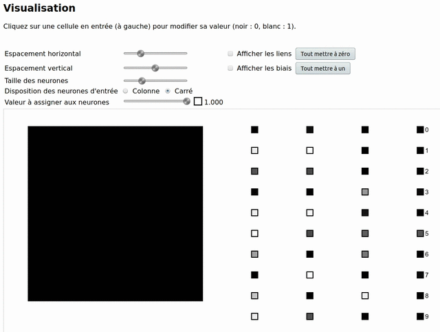
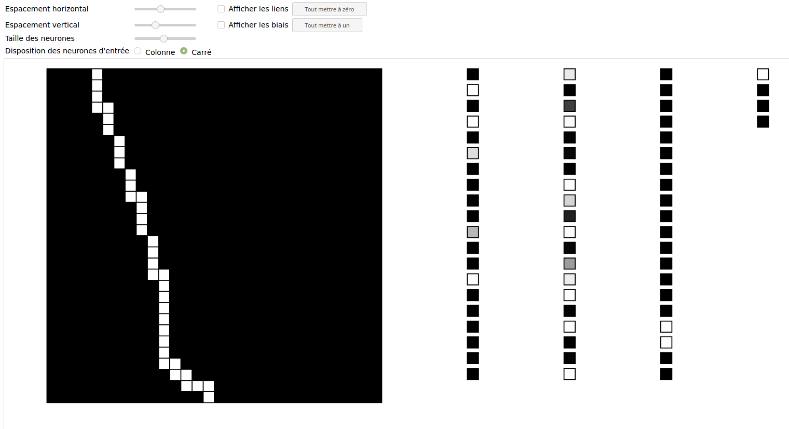
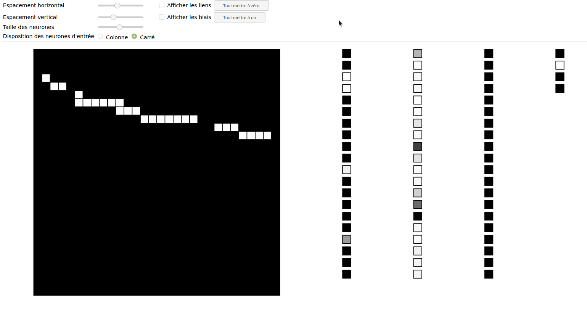
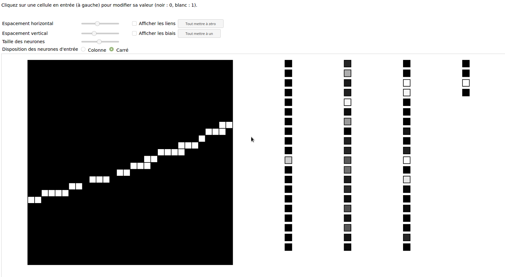
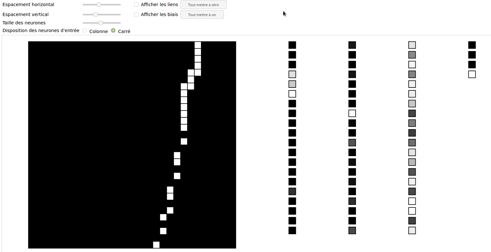

# NeuralNetwork

Back Propagation Neural Network (BPN). Evaluation, training and visulization.

 - This code is a fork from [Bobby Anguelov's NeuralNetwork](https://github.com/BobbyAnguelov/NeuralNetwork).
 - The code makes use of [Florian Rappl's command parser](https://github.com/FlorianRappl/CmdParser )

The following example shows a neural network trained using the <a href="http://yann.lecun.com/exdb/mnist/">MNIST</a> database of hand written digits. <a href="http://xprov.org/gui/fcnn.html">Try it yourself</a>.
 
<kbd>
  
</kbd>


# Disclaimer
This code is meant to be a simple implementation of the back-propagation neural network discussed in the tutorial below:

[https://takinginitiative.wordpress.com/2008/04/03/basic-neural-network-tutorial-theory/](https://takinginitiative.wordpress.com/2008/04/03/basic-neural-network-tutorial-theory/)

[https://takinginitiative.wordpress.com/2008/04/23/basic-neural-network-tutorial-c-implementation-and-source-code/](https://takinginitiative.wordpress.com/2008/04/23/basic-neural-network-tutorial-c-implementation-and-source-code/)


## Project overview

This project contains three programs :

 - `trainPBN` initializes and trains BPN (native C++)
 - `evalNN` evaluates a BPN on given entries (native C++).
 - a graphic interface for the visualization of a BPN (HTML5 + JS).


## Compilation

### Compile under Gnu/Linux

#### Using `cmake` (recommended)

 - Using Synaptic Manager, install the required compilation tools

	```
	sudo apt update
	sudo apt install g++ make cmake
	```

 -  __Compilation__

	```
	mkdir build
	cd build
	cmake ..
	make
	```

 - __Debug VS Release Mode__

	Since training of neural networks requires a lot of computation, one might find useful to compile a debug and a release versions (the release version should run significantly faster):
	```
	mkdir debug && cd debug && cmake -DCMAKE_BUILD_TYPE=Debug .. && make -j
	cd ..
	mkdir release && cd release && cmake -DCMAKE_BUILD_TYPE=Release .. && make -j
	```

 - __Run__

	From the `build` folder
	```
	./trainNN -h
	./evalNN -h
	```


#### Using `make`
 
 - Using Synaptic Manager, install the required compilation tools

	```
	sudo apt update
	sudo apt install g++ make
	```

 - __Compilation__

	```
	make
	```
	This creates a `build` directory where executable files are found.

 - __Run__

	From the `build` folder
	```
	./trainNN -h
	./evalNN -h
	```

### Compile under Mac

Pretty much the same thing as under Gnu/Linux, just install `cmake` and `g++`
using `brew` instead of `apt`.


### Compile under Windows

Disclaimer: I don't know what I'm doing here. If you know a simpler way please let me know.

 - Install `Microsoft Visual Studio`
 - Make sure that  _Workload_ named __Desktop development with C++__ is
   installed either by selecteing it during the installation process or, in
   Visual Studio, open the __Tools__ menu and then __Get tools and
   features...__.
 - Using __File explorer__ go to the `NeuralNetwork` folder. 
 - Double click on the file `trainBPN.vcxproj`. If a prompt ask for which
   software to use, select `Visual Studio` or `Visual Studio Version Selector`.
 - In `Visual Studio`, locate the __Solution explorer__ in which you should see
   the `trainBPN` project. Right click on `trainBPN` and select __Build__.
 - Do the same with the `evalNN.vcxproj`.


## Execution

__For Windows users__: this project tries to respect the [Unix
philosophy](https://en.wikipedia.org/wiki/Unix_philosophy), therefor it uses
command lines arguments. Although, these can be specified within `Visual
Studio` I suggest you to use a shell. 

 - In `File explorer`, go to the `NeuralNetwork` folder and then in the folder
   where is located the executable file you want to use.
 - Hold the __shift__ key and right click in the folder.
 - Select __Open command window here__ or __Open PowerShell here__.

Using the Windows CLI, everything works pretty much as shown here, the main
difference is to use '\\' instead of'/' between folder names.


### Train a BPN
Let's train a Network using data from the
``Examples/threeShapes/data/threeShapes.csv`` file. In this example, the input
are binary pictures of size 40x40. Consequently, there needs to be 1600 input
neurons on the first layer. The output layer must have size 3 since the inputs
are classified in three categories :

1. Straight line (first output neuron).
2. Rectangle (second output neuron).
3. Triangles (third output neuron).

Here we choose to have 3 hidden layers of size 20, so the "-l" argument is
"1600,20,20,20,3". Finally, we stop the learning once our network has obtained
at least 90% accuracy on the generalization set.

```
./trainBPN -d ../Examples/threeShapes/data/threeShapes.csv -l 1600,20,20,20,3 -a 90 -e myTrainedNN
Input file: ../Examples/threeShapes/data/threeShapes.csv
Read complete: 100000 inputs loaded

 Neural Network Training Starting: 
==========================================================================
 LR: 0.01, Momentum: 0.9, Max Epochs: 100
 1600 Input Neurons, 3 Hidden Layers, 3 Output Neurons
==========================================================================

Epoch :0 Training Set Accuracy:25.0967%, MSE: 0.187347 Generalization Set Accuracy:25.62%, MSE: 0.182734
Epoch :1 Training Set Accuracy:26.87%, MSE: 0.159222 Generalization Set Accuracy:25.725%, MSE: 0.143087
Epoch :2 Training Set Accuracy:24.225%, MSE: 0.137596 Generalization Set Accuracy:23.925%, MSE: 0.131987
Epoch :3 Training Set Accuracy:24.0633%, MSE: 0.128191 Generalization Set Accuracy:26.735%, MSE: 0.122087
Epoch :4 Training Set Accuracy:32.175%, MSE: 0.115479 Generalization Set Accuracy:41.26%, MSE: 0.10896
Epoch :5 Training Set Accuracy:44.265%, MSE: 0.100699 Generalization Set Accuracy:57.36%, MSE: 0.0884957
[...]
```

Note that in the above example, the trained network is exported to the file ``myTrainedNN``.

# Visualization of a BPN

Open the file `gui/fcnn.html` in you favorite browser. Instruction are displayed within the page.
For example, the following images show an import of the pre-trainted network
`Examples/slope/trainedNN/900_20_20_20_4`. Input neurons are displayed as a grid
since the inputs are images, each pixel provides the value of one input neuron.
The output neurons have the following interpretation:

 - First neuron : a straight line with a strongly negative slope (less than -1).

 - Second neuron : a straight line with a weakly negative slope (between -1 and 0).

 - Third neuron : a straight line with a weakly positive slope (between 0 and 1).

 - Fourth neuron : a straight line with a strongly positive slope (more than 1).



# Basic customization

To Build a Neural Network requires many choices. For a neophyte, many of these
choices may seem arbitrary. The whole point of this project is to allow the
user to test different choices.

### New activation functions

The addition of a new activation function requires 3 steps:

 - In file __src/ActivationFunctions.h__ each activation function is
   implemented as a class that inherits from class ``ActivationFunction``.
   There are three functions to override : 
     - ``double evaluate( double x )`` which computed the activation function for an input ``x``.
     - ``double evalDerivative( double x, double fx )`` which computed the
       derivative of the function for an input ``x``. Note that a second
       parameter ``fx`` is specified, this parameter is the value of the activation
       function for input ``x`` (not used in general but it does speed up the
       computation in certain cases).
     - ``std::string serialize()`` returns a string that represents the function.

    __Copy__ one of the existing subclasses, __rename__ it and __update__ the three
    abovementioned functions.

 - In file __src/ActivationFunctions.cpp__ update function ``deserialize(const std::string& s)``. 
   This function is the inverse of ``serialize``, it parses a string in order
   return the corresponding activation function.

 - In file __src/trainBPN.cpp__ at the beginning of the ``main`` function,
   update the documentation string for optional parameter "``s``" consequently
   to what you have done.


### Modify weights initialization

When building a new neural networks, random weights are generated in function
``Network::InitializeWeights()`` found in file __src/NeuralNetwork.cpp__. 


